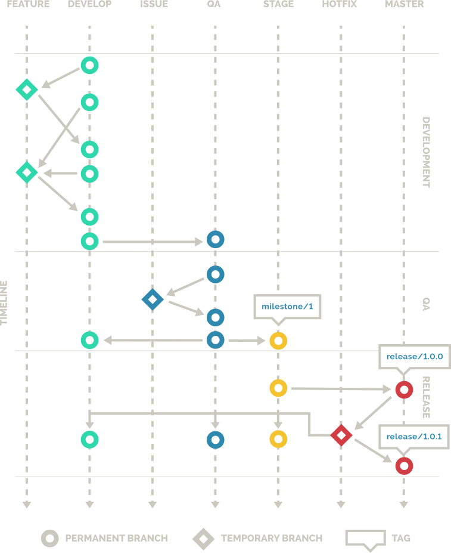
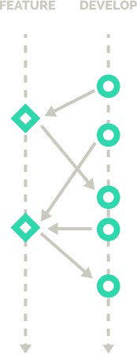
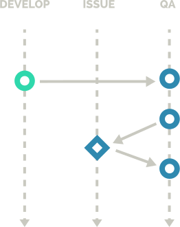
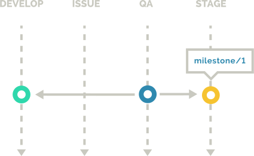
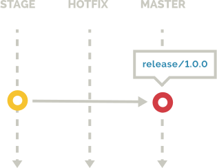
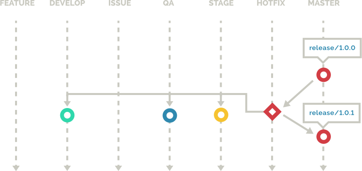

# CakeDC GIT WORKFLOW


*Este documento foi traduzido do inglês pela equipe Gumga,
O documento original pode ser acessado [aqui](https://www.cakedc.com/git-workflow)*

CakeDc Git Workflow é um fluxo de trabalho que provê um ciclo de desenvolvimento e revisão baseado em fases


* **Desenvolvimento:** Todo desenvolvimento ativo é direcionado por **milestones**, e contém o código fonte instável que acabou de sair do forno
* **QA:**  Teste de garantia de qualidade, funciona como parte do ciclo de desenvolvimento, avaliando tanto a conformidade dos requisitos quanto os critérios de aceitação.
* **Revisão:** Clientes ou revisores podem verificar o código fonte estável, que passou pelo processo de QA garantindo a conformidade dos requisitos e critérios de aceitação.
* **Release:** Uma nova release é gerada após a aceitação dos processos de Revisão e QA

O fluxo de trabalho do CakeDC foi baseado no [gitflow design](http://nvie.com/posts/a-successful-git-branching-model/), implementado por [Vincent Driessen](http://nvie.com/about/). Embora existam similaridades entre esses padrões, eles não são compatíveis.

## Organização

O principal design do CakeDC Workflow é designado para times ou companhias no qual desejam integrar um processo de qualidade como parte de seus ciclos de desenvolvimento, bem como prover um servidor estável de testes para os clientes revisarem a aprovarem releases pendentes. Porém, estes passos podem ser facilmente ignorados por aqueles que não proverem suas partes dos seus fluxos de trabalho ativamente.

As fases que serão passadas para o ciclo total de desenvolvimento e das **releases** são quebradas em objetivos, que serão referenciados como **milestones**. É importante lembrar que uma milestone não necessariamente é uma release. A versão do projeto pode ser composto de várias milestones, dependendo do planejamento do projeto e dos recursos disponíveis.
 
As fases são representadas por branches “permanentes” e “temporárias” no repositório do Git, que facilitará o desenvolvimento do processo das releases. A razão principal da existência das branches é prover o desenvolvimento multifacetado, permitindo que qualquer um visualizar o status de uma aplicação em diferentes estágios de seu desenvolvimento. Estes dois tipos de branches formam diretamente o fluxo de trabalho.


## Branches Permanentes
* **develop** - Também referenciada como “saindo do forno”, esta branch contém features da atual milestone. Esta é uma base alpha de códigos, que é considerada muito instável.
* **qa** - Todos os desenvolvimentos ativos da milestone são eventualmente testados nesta branch. E os códigos também são considerados instáveis.
* **stage** - Uma vez que o desenvolvimento da milestone foi testado e passado pela branch qa, esta branch então hospeda uma base estável de código para revisão.
* **master** - Após toda aprovação dada pelo cliente ou revisor, o código da branch stage será feito um merge com a branch master, que será a versão atual do projeto no ambiente de produção.

## Branches Temporárias
* **feature** - Essas branches são criadas a partir da branch develop e são desenvolvimentos isolados por cada tarefa. Definição de feature: é muito dependente do estilo de gerenciamento aplicado no projeto, e se a feature é de uma sprint longa ou curta.
* **issue** - Essas branches são criadas a partir da branch qa para solucionar um problema reportado pelo time de QA enquanto é testado uma milestone completa.
* **hot-fix** - Essas branches são criadas para tratar problemas sérios e urgentes detectados no ambiente de produção(branch master). Em um cenário perfeito, estas branches nunca deveriam ser criadas se o processo do time de QA é eficiente o bastante para passar um código estável para a branch stage revisar. 

Uma importante diferença entre as branches permanentes e temporárias é que nenhuma mudança pode ser feito diretamente nas branches permanentes, elas só podem ser inseridas via merge de uma branch temporária. O processo é representado pelo diagrama abaixo:




As sessões seguintes são as fases de desenvolvimento e ciclos de release, e será explicado cada processo em detalhes.

## Desenvolvimento
Durante o desenvolvimento de uma **milestone**, desenvolvedores vão criar as branches de **feature**, baseado no código que está na branch **develop**.



Essas branches são chamadas de **“feature/”** seguido do nome do identificador da tarefa. Geralmente esses identificadores são os IDs do ticket do seu sistema de gerenciamento. Como por exemplo:

```
$ git checkout -b feature/1234 develop
$ git push -u origin feature/1234
```

Separando a tarefa em uma branch separada, desenvolvedores evitam que a branch **develop** seja desestabilizada, e não interferindo no trabalho realizado pelos colegas. As branches podem ser atualizadas com outras features já commitadas na branch develop, se a feature se integrar ou se basear em outra feature. 
Se estiver trabalhando na mesma feature que outro desenvolvedor, você pode acessar a mesma branch dele e trabalhar em conjunto.

```
$ git checkout -t origin/feature/1234
```

Quando o desenvolvimento da feature estiver finalizada, é feito merge na branch develop e então a branch é deletada.

```
$ git checkout develop
$ git merge --no-ff feature/1234
$ git branch -d feature/1234
$ git push origin : feature/1234
```

Enquanto a branch develop é considerada instável, é um grande benefício para os desenvolvedores ter um servidor hosteando esta branch, para que eles consigam revisar facilmente a versão saindo do forno do projeto, ajudando na discussão e permitindo uma revisão do projeto atual. Esta prática também ajuda os gerentes de projeto não familiares com o processo de desenvolvimento a terem um status real do que está para vir na branch de qa.

## Testando

Quando uma **milestone** é considerada finalizada, a branch develop é dada merge com a branch **qa**, e então, o processo de qualidade se inicia.



É importante dizer que, quando a branch **develop** é dada merge com a **qa**, quaisquer novas features constituirão a próxima **milestone**. Isso permite o teste  da milestone atual e também o teste do desenvolvimento da próxima que está sendo desenvolvida paralelamente. Além disso, o processo de qualidade é controlado em uma branch dedicada, isso permite que a fase de testes seja agendada sem nenhum impedimento para continuar.

```
$ git checkout qa
$ git merge --no-ff develop
```
Durante a fase de teste é possível que o time de qualidade descubra problemas no desenvolvimento da **milestone**, fazendo com que falhe algumas features. Quando isso acontece, às modificações necessárias para corrigir esses bugs são a criação das branches de issues, baseados no código da branch **qa**. Essas branches são nomeadas de “issue/”, seguido pelo identificador da tarefa, que geralmente é o ID do ticket, por exemplo:
```
$ git checkout -b issue/1234 **qa**
$ git push -u origin issue/1234
```

Enquanto ativas, as branches podem ser atualizadas com outras issues que foram commitadas com a branch **qa**, se uma issue depender da conclusão de outro. Quando uma **issue** for resolvida, é dada marge com a branch **qa** e a branch de issue é deletada. 
```
$ git checkout qa
$ git merge --no-ff issue/1234
$ git branch -d issue/1234
$ git push origin :issue/1234
```
Durante a fase de qualidade, é provável que seja disponibilizado um servidor de teste. Então é implantado a branch **qa** para o time de qualidade fazer os testes. A fase de qualidade do projeto é ambígua como a natureza dos testes, e como o processo pode variar significamente dependendo dos requisitos e do tipo do projeto, então os fatores que determinam se a **milestone** está completa e o código está estável podem variar.


## Revisão
uma vez que um milestone  tenha passado pelo desenvolvimento, e passado pelo processo de QA, a nova funcionalidade agora está pronta para ser adicionada ao stage para revisão



aqui, foi feito merge da branch QA ao stage, e também foi feito o merge de volta para a develop para milestones futuras, segue o exemplo:

```
$ git checkout develop
$ git merge --no-ff qa
$ git checkout stage
$ git merge --no-ff qa
```

Adicionalmente, a fim de marcar o fim da milestone, um tag é criado da branch stage. Esses tags são nomeados como **“milestone/”**, seguido pelo identificador da milestone, que normalmente é um número sequencial. O tag também pode ser criptografado usando os parâmetros -s ou -u

```
$ git tag -a milestone/1
```
A branch stage pode agora ser compilada para um servidor de testes do cliente ou revisor para aprovação. Se algum problema for detectado ou nova funcionalidade tiver sido implementada nessa etapa, eles se tornarão parte da milestone ativa na branch develop, ou agendados para desenvolvimento futuro.

Nenhuma modificação deve ser feita diretamente na qa ou branches stage, somente através da herança da branch feature que foi feito merge para a develop, e passado pelo processo da qa novamente. É muito importante respeitar este processo, no entanto, pode parecer fácil corrigir a branch stage, embora isso possa comprometer o processo de garantia de qualidade.


## Release
Quando a branch stage tive sido revisada, após completar uma ou mais milestones, uma release pode ser criada. Isso é o código fonte é atualizado no ambiente de produção e isso reflete em uma nova versão da aplicação



Para criar a release, é feito o merge da branch stage para a master, por exemplo:
```
$ git checkout master
$ git merge --no-ff stage
```
Adicionalmente, a fim de marcar a criação da release, uma tag é criada a partir da branch master. Essas tags são chamadas **“release/”** seguido pelo número da versão, o qual pode variar entre projetos dependendo da estratégia de versionamento usada. A tag também pode ser criptografada com os parâmetros -s ou -u 
```
$ git tag -a release/1.1.0
```

Todo código que foi unido da branch qa para a stage após a nova release agora constituem a próxima versão da aplicação

## Hot Fixes

Esta situação raramente acontecerá quando estiver realmente implementando este fluxo de trabalho, algumas vezes alguns bugs urgentes serão detectados no ambiente de produção, e não poderá esperar para uma outra release ser criada.



Nestes casos, a branch de hot-fix é criada, baseada no código da branch master. Às branches são nomeadas de **“hot-fix/”**, seguido pelo identificador da tarefa, por exemplo:

```
$ git checkout -b hot-fix/1234 master
$ git push -u origin hot-fix/1234
```

Dependendo dos requisitos impostos pelo time de qualidade, será necessário realizar testes do patch após a **hot-fix** ser resolvida. Tem três modos de lidar com esta situação:

* **Kamakazee:** Aqui é onde a **hot-fix**  é dado merge direto na master, e o time de qualidade faz os testes no ambiente de produção. Este é altamente desaconselhado já que podem resultar bugs de inconsistência de dados.
* **Copycat:** Aqui é onde a **hot-fix** é dado merge diretamente na master, e a é implementada em um servidor dedicado. Isso pode não ser possível se o ambiente de produção for implementado automaticamente, baseado nos pushs do respositório ou builds agendados.
* **Paranoid:** Aqui é onde a **hot-fix** é colocada em um servidor dedicado, para o time de qualidade revisar antes de dar marge com a master. O servidor pode ser replicado do ambiente de produção. Talvez isso não pode ser uma opção baseada em acordos ou obrigações legais, sendo uma alternativa encenar no próprio servidor de produção.

Uma vez que o patch teve sucesso, a branch de **hot-fix** deve ser propagado para as branches de stage, qa e develop também.

```
$ git checkout master
$ git merge --no-ff hot-fix/1234
$ git checkout stage
$ git merge --no-ff hot-fix/1234
$ git checkout qa
$ git merge --no-ff hot-fix/1234
$ git checkout develop
$ git merge --no-ff hot-fix/1234
```

Entretanto, dependendo do tamanho da milestone, É possível que tenham alterações feitas na release pendente de que o problema encontrado na produção já tenha sido corrigido ou que a funcionalidade em torno do problema tenha sido modificada para um ponto em que o problema não exista mais ou tenha sido completamente alterado.

Finalmente, uma vez que o **hot-fix** tenha sido aplicada para todas as outras branches, ela já pode ser removida.
```
$ git branch -d hot-fix/1234
$ git push origin :hot-fix/1234
```
Se encontrar inúmeros bugs no seu ambiente de produção, isso pode ser ocasionado por insuficientes detalhes na branch **stage** do projeto, ou processos ineficientes do time de qualidade. Tenha em mente que o processo de qualidade é tão importante como qualquer outro critério inicial, então validar esta especificação é a chave para o sucesso do projeto.
E também é importante ressaltar que o desenvolvedor que criar uma branch temporária permanecer responsável por ela, já que será mais provável que eles conheçam os status das branches  


License
----

LGPL-3.0


**Free Software, Hell Yeah!**